# Лабораторная работа № 1

## Задание 1


## Задание 2


## Задание 3 


## Задание 4


## Задание 5 


# Лабораторная работа № 2

## Задание 1

```python
def min_max(nums: list[float | int]) -> tuple[float | int, float | int]:
    if not nums:
        return 'ValueError'
    return (min(nums), max(nums))
t = [3, -1, 5, 5, 0]
m = [42]
n = [-5, -2, -9]
b = []
a = [1.5, 2, 2.0, -3.1]
print(min_max(t))
print(min_max(m))
print(min_max(n))
print(min_max(b))
print(min_max(a))
```
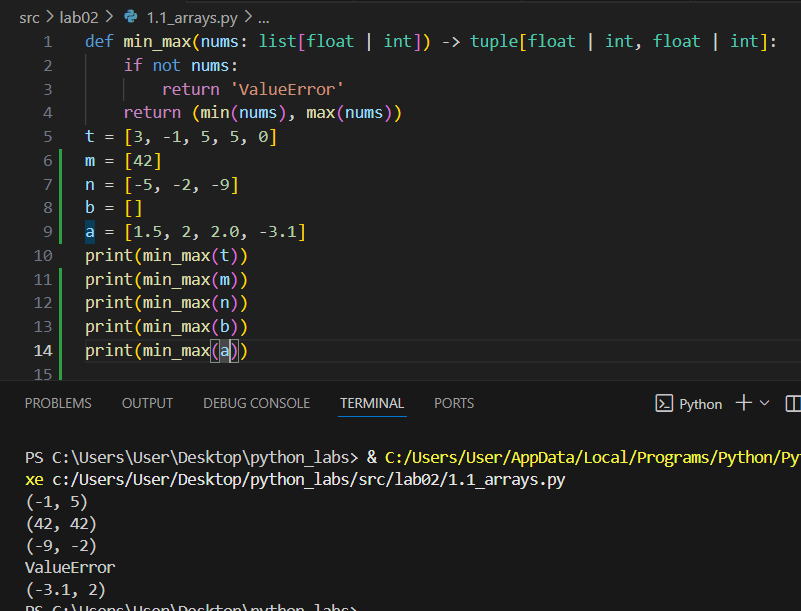

```python
def unique_sorted(nums: list[float | int]) -> list[float | int]:
    if not nums:
        return []
    return sorted(set(nums))
t = [3, 1, 2, 1, 3]
c = []
a = [-1, -1, 0, 2, 2]
b = [1.0, 1, 2.5, 2.5, 0]
print(unique_sorted(t))
print(unique_sorted(c))
print(unique_sorted(a))
print(unique_sorted(b))
```


```python
def flatten(mat: list[list | tuple]) -> list:
    res = []
    for r in mat:
        if not isinstance(r, (list, tuple)):
            return 'TypeError'
        res.extend(r)
    return res
t = [[1, 2], [3, 4]]
a = [[1, 2], (3, 4, 5)]
b = [[1], [], [2, 3]]
c = [[1, 2], "ab"]
print(flatten(t))
print(flatten(a))
print(flatten(b))
print(flatten(c))
```
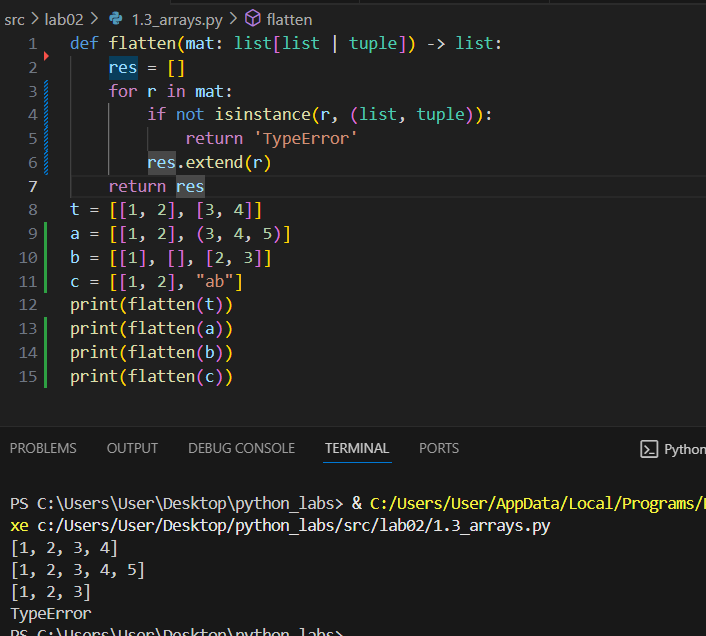

## Задание 2

```python
def transpose(mat: list[list[float | int]]) -> list[list]:
    if not mat:
      return []
    
    row = len(mat[0])
    for row1 in mat:
        if len(row1) != row:
         return 'ValueError'
    return [[mat[q][w] for q in range(len(mat))] for w in range(row)]
t = [[1, 2, 3]]
a = [[1], [2], [3]]
b = [[1, 2], [3, 4]]
c = []
d = [[1, 2], [3]]
print(transpose(t))
print(transpose(a))
print(transpose(b))
print(transpose(c))
print(transpose(d))
```
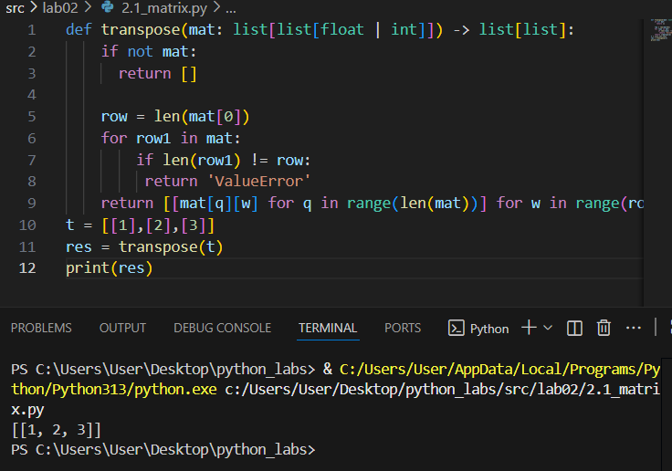

```python
def row_sums(mat: list[list[float | int]]) -> list[float]:
    if not mat:
      return []
    
    row = len(mat[0])
    for row1 in mat:
        if len(row1) != row:
         return 'ValueError'
    return [sum(r) for r in mat]
t = [[1, 2, 3], [4, 5, 6]]
a = [[-1, 1], [10, -10]]
b = [[0, 0], [0, 0]]
c = [[1, 2], [3]]
print(row_sums(t))
print(row_sums(a))
print(row_sums(b))
print(row_sums(c))
```
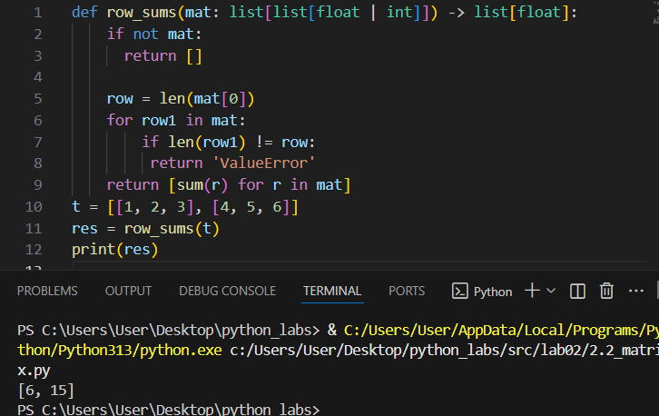

```python
def col_sums(mat: list[list[float | int]]) -> list[float]:
    if not mat:
      return []
    
    row = len(mat[0])
    for row1 in mat:
        if len(row1) != row:
         return 'ValueError'
    return [sum(r) for r in zip(*mat)]
t = [[1, 2, 3], [4, 5, 6]]
a = [[-1, 1], [10, -10]]
b = [[0, 0], [0, 0]]
c = [[1, 2], [3]]
print(col_sums(t))
print(col_sums(a))
print(col_sums(b))
print(col_sums(c))
```
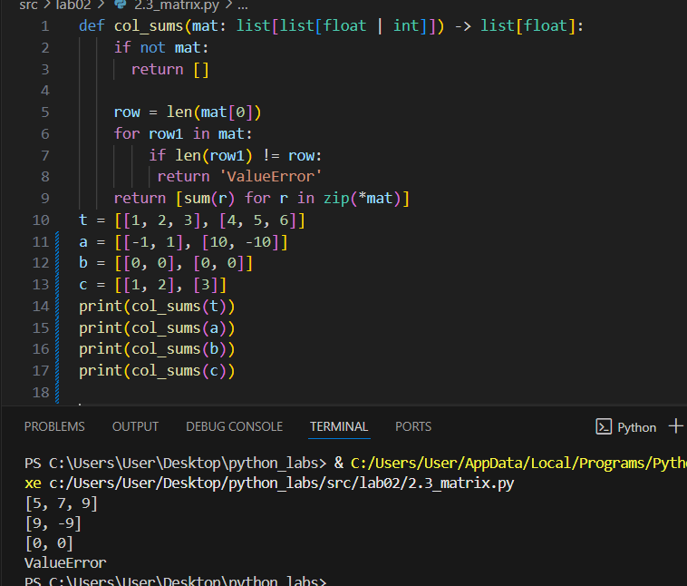

## Задание 3

```python
def format_record(rec: tuple[str, str, float]) -> str:
    try:
        fio, gr, gpa = rec
        fio2 = ' '.join(fio.split()).split()
        fam = fio2[0]

        if (fio not in rec) or (gr not in rec) or (gpa not in rec):
            return 'ValueError'

        ini = []
        for i in range(1, len(fio2)):
            if i <= 2:
                ini.append(f"{fio2[i][0]}.")
        res = f"{fam} {''.join(ini)}, гр. {gr}, GPA {gpa:.2f}"
        return res
    except:
       return 'ValueError'
t = ("Иванов Иван Иванович", "BIVT-25", 4.6)
a = ("Петров Пётр", "IKBO-12", 5.0)
b = ("Петров Пётр Петрович", "IKBO-12", 5.0)
c = ("  сидорова  анна   сергеевна ", "ABB-01", 3.999)
d = (" ", "ABB-01")
print(format_record(t))
print(format_record(a))
print(format_record(b))
print(format_record(c))
print(format_record(d))
```

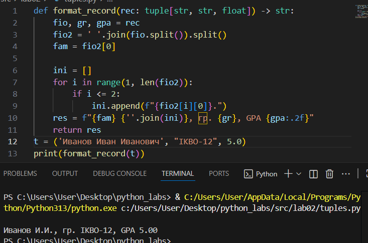


# Лабораторная работа № 3

## Задание 1

### Normalize

```python
def normalize(text: str, *, casefold: bool = True, yo2e: bool = True) -> str:
    if yo2e:
        text = text.replace('ё', 'е').replace('Ё', 'Е')
    if casefold:
        text = text.casefold()
    text = ' '.join(text.split())
    text = text.strip()
    return text
a = 'ПрИвЕт\nМИр\t'
b = "ёжик, Ёлка"
c = "Hello\r\nWorld"
d = "  двойные   пробелы  "
print(normalize(a))
print(normalize(b))
print(normalize(c))
print(normalize(d))
```
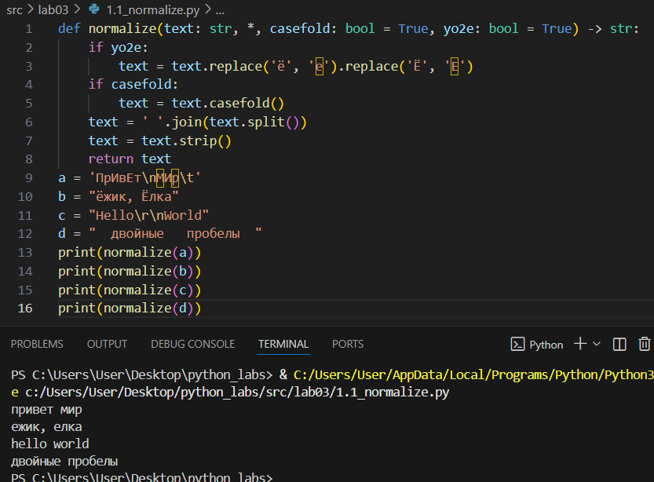

### Tokenize

```python
import re

def tokenize(text: str) -> list[str]:
    t = r'[\w]+(?:-[\w]+)*'
    l = re.findall(t, text, re.UNICODE)
    return l

a = "привет мир"
b = "hello,world!!!"
c = "по-настоящему круто"
d = "2025 год"
e = "emoji 😀 не слово"
print(tokenize(a))
print(tokenize(b))
print(tokenize(c))
print(tokenize(d))
print(tokenize(e))
```

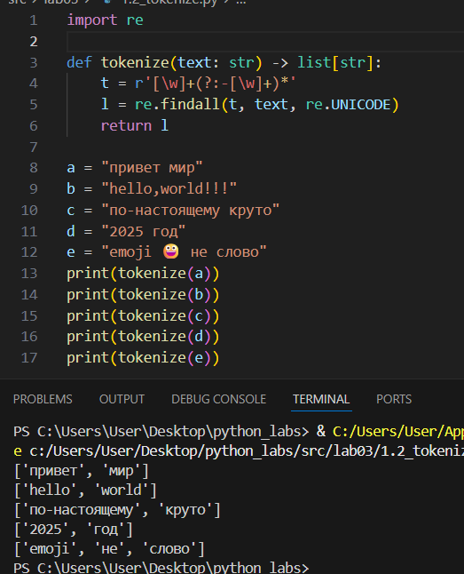

### Count_freq + top_n
```python
def count_freq(tokens: list[str]) -> dict[str, int]:
    freq = {}
    for i in tokens:
        if i in freq:
            freq[i] += 1
        else:
            freq[i] = 1
    return freq

def top_n(freq: dict[str, int], n: int = 5) -> list[tuple[str, int]]:
    items = []
    for word in freq:
        count = freq[word]
        items.append((word, count))
    items.sort(key=lambda i: (-i[1], i[0]))
    return items[:n]


a = ["a","b","a","c","b","a"]
b = ["bb","aa","bb","aa","cc"]
print(count_freq(a))
print(count_freq(b))
print(top_n(count_freq(a)))
print(top_n(count_freq(b)))
```

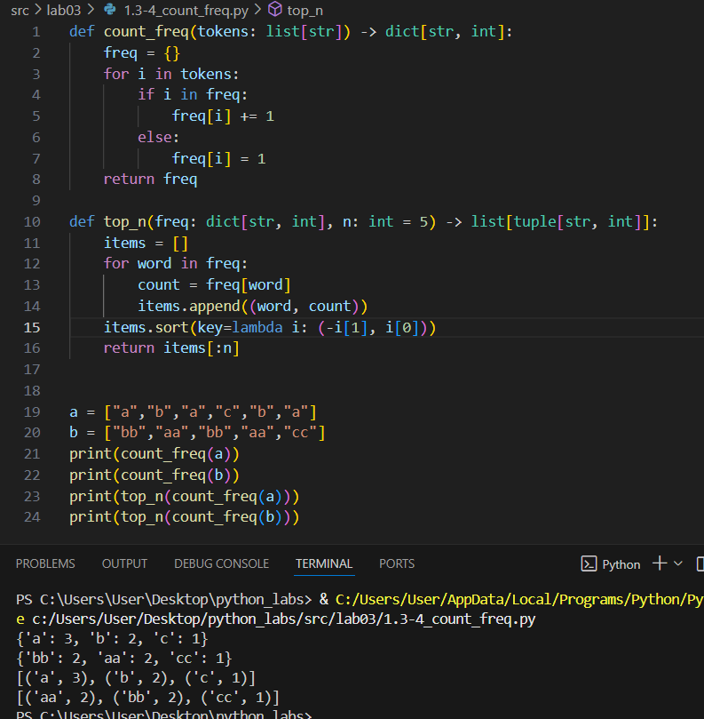

## Задание 2

### Задание B

```python
import sys
import re

def normalize(text: str, *, casefold: bool = True, yo2e: bool = True) -> str:
    if yo2e:
        text = text.replace('ё', 'е').replace('Ё', 'Е')
    if casefold:
        text = text.casefold()
    text = ' '.join(text.split())
    text = text.strip()
    return text

def tokenize(text: str) -> list[str]:
    t = r'[\w]+(?:-[\w]+)*'
    l = re.findall(t, text, re.UNICODE)
    return l

def count_freq(tokens: list[str]) -> dict[str, int]:
    freq = {}
    for i in tokens:
        if i in freq:
            freq[i] += 1
        else:
            freq[i] = 1
    return freq

def top_n(freq: dict[str, int], n: int = 5) -> list[tuple[str, int]]:
    items = []
    for word in freq:
        count = freq[word]
        items.append((word, count))
    items.sort(key=lambda i: (-i[1], i[0]))
    return items[:n]

a =  "Привет, мир! Привет!!!"

nt = normalize(a)
allwords = tokenize(nt)
uw = count_freq(allwords)
top = top_n(uw, 5)

print(f'Всего слов: {len(allwords)}')
print(f"Уникальных слов: {len(uw)}")
print("Топ-5:")
for y in top:
    print(y[0] + ': ' + str(y[1]))
```

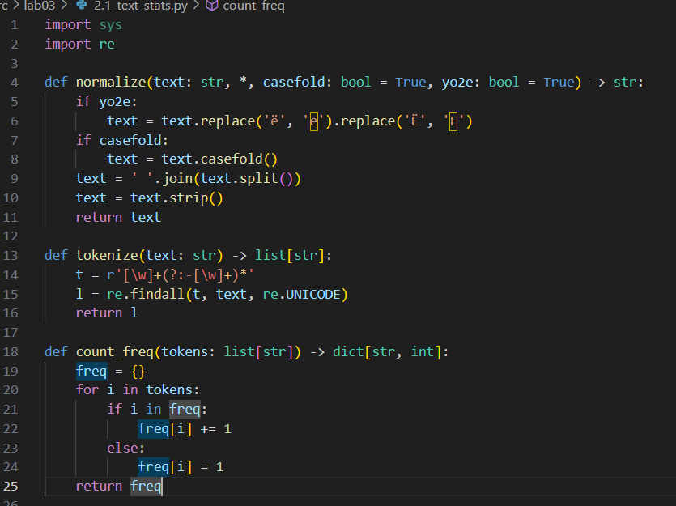
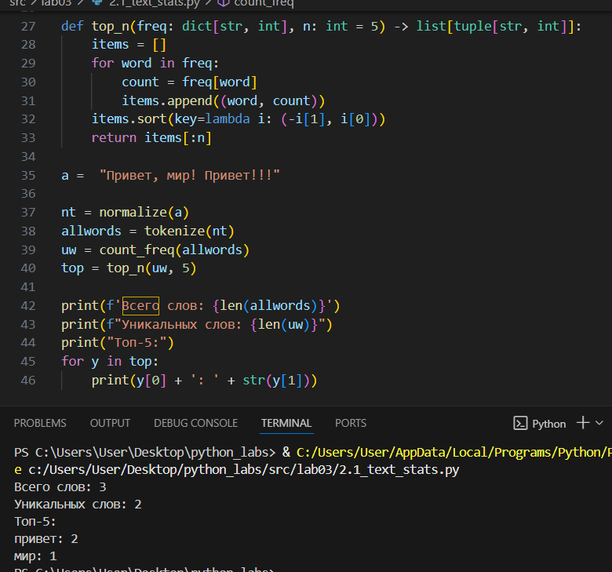


# Лабораторная работа № 4

## Функции, файл io_txt_csv.py: 
```python
from pathlib import Path
import csv
import re

def normalize(text: str, *, casefold: bool = True, yo2e: bool = True) -> str:
    """Нормализует текст: приводит к нижнему регистру, заменяет ё на е, убирает лишние пробелы"""
    if yo2e:
        text = text.replace('ё', 'е').replace('Ё', 'Е')
    if casefold:
        text = text.casefold()
    text = ' '.join(text.split())
    text = text.strip()
    return text

def tokenize(text: str) -> list[str]:
    """Разбивает текст на токены (слова)"""
    t = r'[\w]+(?:-[\w]+)*'
    l = re.findall(t, text, re.UNICODE)
    return l

def count_freq(tokens: list[str]) -> dict[str, int]:
    """Подсчитывает частоту каждого токена"""
    freq = {}
    for i in tokens:
        if i in freq:
            freq[i] += 1
        else:
            freq[i] = 1
    return freq

def top_n(freq: dict[str, int], n: int = 5) -> list[tuple[str, int]]:
    """Возвращает топ-N самых частых токенов"""
    items = []
    for word in freq:
        count = freq[word]
        items.append((word, count))
    items.sort(key=lambda i: (-i[1], i[0]))
    return items[:n]

def read_text(path: str | Path, encoding: str = "utf-8") -> str:
    """Читает текст из файла"""
    print(f"Читаю файл: {path}")
    p = Path(path)
    text = p.read_text(encoding=encoding)
    print(f"Прочитал {len(text)} символов")
    return text

def write_csv(rows: list[tuple | list], path: str | Path,
                header: tuple[str, ...] | None = None) -> None:
    """Записывает данные в CSV файл"""
    p = Path(path)

    if rows:
        first_length = len(rows[0])
        for i, row in enumerate(rows):
            if len(row) != first_length:
                raise ValueError(f"ошибка лютая")
            
    with p.open('w', newline='', encoding='utf-8') as f:
        writer = csv.writer(f)

        if header is not None:
            writer.writerow(header)

        for row in rows:
            writer.writerow(row)
```

## Задание А
```python
from pathlib import Path
import sys

current_dir = Path(__file__).parent
sys.path.append(str(current_dir))

from io_txt_csv import normalize, tokenize, count_freq, top_n, read_text, write_csv

def main():
    current_file = Path(__file__)
    print(f"Текущий файл: {current_file}")

    input_path = current_file.parent / 'data' / 'input.txt'
    output_path = current_file.parent / 'data' / 'output.csv'

    print(f"Путь к входному файлу: {input_path}")
    print(f"Путь к выходному файлу: {output_path}")

    input_path.parent.mkdir(parents=True, exist_ok=True)
    input_path.write_text("Привет, мир! Привет!!!", encoding='utf-8')
    print(f"Создан/обновлен файл: {input_path}")

    result = read_text(input_path)
    print(f"Результат чтения: {result}")

    normalized_text = normalize(result)
    print(f"Нормализованный текст: {normalized_text}")

    tokens = tokenize(normalized_text)
    print(f"Токены: {tokens}")

    frequencies = count_freq(tokens)
    print(f"Частоты: {frequencies}")

    word_counts = top_n(frequencies, n=len(frequencies))
    print(f"Подсчет слов: {word_counts}")

    write_csv(word_counts, output_path, header=('word', 'count'))
    print(f"CSV файл создан: {output_path}")

if __name__ == "__main__":
    main()
```

## Задание B 
```python
from pathlib import Path
from io_txt_csv import normalize, tokenize, count_freq, top_n, read_text, write_csv

current_file = Path(__file__)
input_path = current_file.parent.parent / "src/data/input_test.txt"
output_path = current_file.parent.parent / "src/data/output.csv"

print(f"Текущий файл: {current_file}")
print(f"Входной файл: {input_path}")
print(f"Выходной файл: {output_path}")

input_path.parent.mkdir(parents=True, exist_ok=True)
if input_path.exists():
    input_path.unlink()
input_path.write_text("Привет", encoding="utf-8")
print(f"Создан пустой файл: {input_path}")

text = read_text(input_path, "utf-8")
print(f"Прочитано: '{text}' ({len(text)} символов)")

normalized_text = normalize(text)
tokens = tokenize(normalized_text)
frequencies = count_freq(tokens)

print(f"Токены: {tokens}")
print(f"Частоты: {frequencies}")

word_counts = top_n(frequencies, n=len(frequencies))
write_csv([[word, count] for word, count in word_counts], 
          output_path, header=('word', 'count'))
print(f"CSV создан: {output_path}")

print(f"Всего слов: {sum(frequencies.values())}")
print(f"Уникальных слов: {len(frequencies)}")

print("Топ 5 слов:")
top_5 = top_n(frequencies, n=5)
for i, (word, count) in enumerate(top_5, 1):
    print(f"  {i}. '{word}': {count}") if top_5 else print("  Нет слов")
```
## Тест кейсы к заданию А:
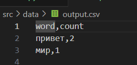
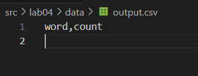

## Тест кейсы к заданию B
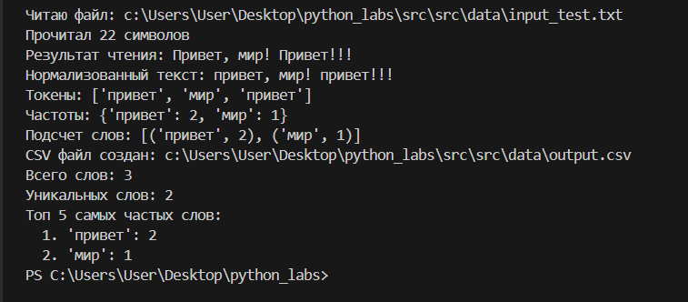
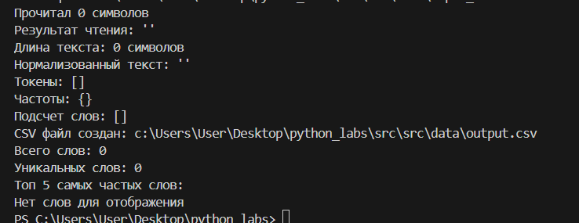
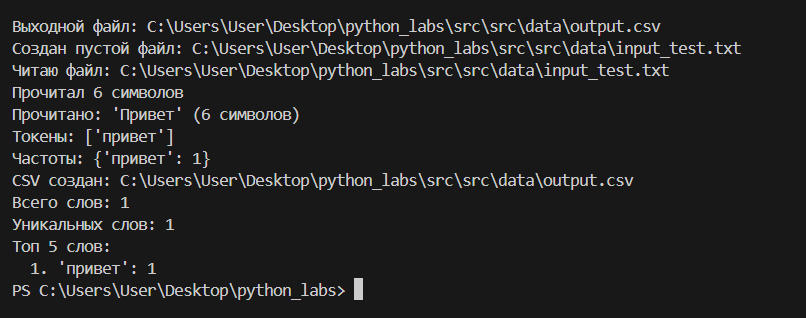


# Лабораторная работа № 5

## Сsv to json
```python
import json
import csv
from pathlib import Path
import sys

current_file = Path(__file__)

parent_dir = current_file.parent.parent
sys.path.append(str(parent_dir))


def csv_to_json(csv_path: str, json_path: str) -> None:
    encoding = 'utf-8'
    input_path = Path(csv_path)
    output_path = Path(json_path)
    
    if not input_path.exists():
        raise FileNotFoundError('Пожалуйста, проверьте путь к файлу')
    if input_path.suffix.lower() != '.csv':
        raise ValueError('Проверьте расширение файла')
    
    data = []
    with open(input_path, 'r', encoding=encoding, newline='') as csv_file:
        csv_reader = csv.DictReader(csv_file)
        for row in csv_reader:
            data.append(row)
    
    with open(output_path, 'w', encoding=encoding, newline='') as json_file:
        json.dump(data, json_file, ensure_ascii=False, indent=2)
        print('Конвертация прошла успешно')
        print(f'Всего записей конвертировано: {len(data)}')


if __name__ == '__main__':
    csv_to_json('src/data/file1.csv', 'src/data/file1.json')
```

### Csv: 
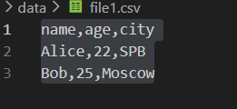
### Полученный json:
.png)


## Json to csv
```python
import json
import csv
from pathlib import Path
import sys

current_file = Path(__file__)

parent_dir = current_file.parent.parent
sys.path.append(str(parent_dir))


def json_to_csv(json_path: str | Path, csv_path: str | Path, encoding: str = "utf-8") -> None:
    input_path = Path(json_path)
    output_path = Path(csv_path)
    
    if not input_path.exists():
        raise FileNotFoundError(f"JSON файл не найден: {json_path}")
    
    with open(input_path, 'r', encoding='utf-8-sig') as json_file:
        data = json.load(json_file)
    
    with open(output_path, 'w', newline='', encoding=encoding) as csv_file:
        writer = csv.DictWriter(csv_file, fieldnames=['name', 'age', 'city'])
        writer.writeheader()
        writer.writerows(data)
    
    print(f'Конвертировано {len(data)} записей')


if __name__ == '__main__':
    json_to_csv('src/data/file2.json', 'src/data/file2.csv')
```
### Json:
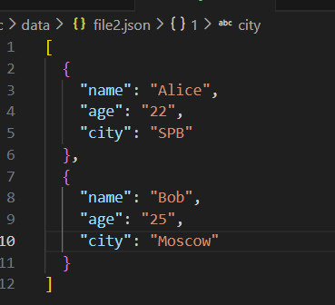
### Полученный csv:
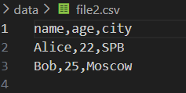


## Csv to xlsx
```python 
import csv
from openpyxl import Workbook
from pathlib import Path
import sys

current_file = Path(__file__)

parent_dir = current_file.parent.parent
sys.path.append(str(parent_dir))


def csv_to_xlsx(csv_path: str | Path, xlsx_path: str | Path, encoding: str = "utf-8") -> None:
    csv_file = Path(csv_path)
    xlsx_file = Path(xlsx_path)
    
    if not csv_file.exists():
        raise FileNotFoundError(f"CSV файл не найден: {csv_path}")
    
    workbook = Workbook()
    worksheet = workbook.active
    worksheet.title = "Data"
    
    with open(csv_file, 'r', encoding=encoding, newline='') as csv_open:
        csv_reader = csv.reader(csv_open)
        
        for row_index, row in enumerate(csv_reader, 1):
            for col_index, value in enumerate(row, 1):
                worksheet.cell(row=row_index, column=col_index, value=value)
    
    workbook.save(xlsx_file)
    print(f"Успешно сконвертировано: {csv_path} -> {xlsx_path}")


if __name__ == '__main__':
    csv_to_xlsx('src/data/file3.csv', 'src/data/file3.xlsx')
```

### Csv:
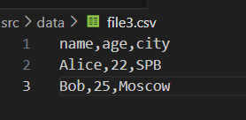
### Полученный xlsx:
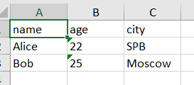

# Лабораторная работа № 6
## cli_text
```python
import argparse
from pathlib import Path
import sys 
current_file = Path(__file__)
 
parent_dir = current_file.parent.parent
sys.path.append(str(parent_dir)) 
from lib.text import frequencies_from_text, sorted_word_counts

def main():
    parser = argparse.ArgumentParser(description='CLI утилита')
    subparser = parser.add_subparsers(dest='command')

    cat_parser=subparser.add_parser(
        'cat',
        help='Вывести содержимое файла',
        description='Вывести содержимое файла построчно. C -n добавляет номера строк'
    )
    cat_parser.add_argument('--input', required=True, help='Путь к входному файлу')
    cat_parser.add_argument('-n', action='store_true', dest='n', help='Нумеровать строки')

    stats_parser=subparser.add_parser(
        'stats',
        help='Анализ частот слов',
        description='Подсчитать частоты слов из файла и вывести топ-N самых частых'
    )
    stats_parser.add_argument('--input', required=True, dest='input', help='Путь к входному файлу')
    stats_parser.add_argument('--top', type=int, default=5, help='Сколько слов показать (по умолчанию 5)')
    args=parser.parse_args()
    if args.command is None:
        raise SystemExit(parser.format_help())

    if args.command == 'cat':
        in_path = Path(args.input)
        if not in_path.exists():
            raise FileNotFoundError(f"Входной файл не найден: {args.input}")
        with open(args.input, 'r', encoding='utf-8') as f:
            if args.n:
                for i, line in enumerate(f, 1):
                    print(f"{i}:{line}", end='')
            else:
                for line in f:
                    print(line, end='')
        
    elif args.command=='stats':
        in_path = Path(args.input)
        if not in_path.exists():
            raise FileNotFoundError(f"Входной файл не найден: {args.input}")
        with open(args.input, 'r', encoding='utf-8') as f:
            content = f.read()
            freqs = frequencies_from_text(content)
            top_words = sorted_word_counts(freqs)[:args.top]
            for word, count in top_words:
                print(f"{word}:{count}")
if __name__=='__main__':
    main()
```
### Справка по программе
```python 
python -m src.lab06.cli_text -h
```
### Справка по команде cat
```python 
python -m src.lab06.cli_text cat -h
```
### Справка по команде stats
```python 
python -m src.lab06.cli_text stats -h
```
### Тестирование команды cat 
```python 
python -m src.lab06.cli_text cat --input data/samples/input.txt -n
```
### Тестирование команды stats
```python 
python -m src.lab06.cli_text stats --input data/samples/input.txt

python -m src.lab06.cli_text stats --input data/samples/input.txt --top 3
```
### Создание тестового файла
```python
Remove-Item data/samples/input.txt
$content = "привет мир это тестовый файл привет программа мир тест"
[System.IO.File]::WriteAllText("data/samples/input.txt", $content, [System.Text.Encoding]::UTF8)
```

## cli_convert
```python
import argparse
from pathlib import Path
import sys

current_file = Path(__file__)
parent_dir = current_file.parent.parent
sys.path.append(str(parent_dir))

from lab05.csv_to_json import csv_to_json
from lab05.csv_to_xlsx import csv_to_xlsx
from lab05.json_to_csv import json_to_csv

def main():
    parser = argparse.ArgumentParser(description='CLI конвертация файлов')
    subparsers = parser.add_subparsers(dest='command')

    # json2csv
    json2csv_parser = subparsers.add_parser(
        'json2csv',
        help='Конвертировать JSON в CSV',
        description='Преобразовать JSON-файл (список объектов) в CSV с заголовком'
    )
    json2csv_parser.add_argument('--in', dest='input', required=True, help='Входной JSON-файл')
    json2csv_parser.add_argument('--out', dest='output', required=True, help='Выходной CSV-файл')

    # csv2json
    csv2json_parser = subparsers.add_parser(
        'csv2json',
        help='Конвертировать CSV в JSON',
        description='Преобразовать CSV-файл в JSON'
    )
    csv2json_parser.add_argument('--in', dest='input', required=True, help='Входной CSV-файл')
    csv2json_parser.add_argument('--out', dest='output', required=True, help='Выходной JSON-файл')

    # csv2xlsx
    csv2xlsx_parser = subparsers.add_parser(
        'csv2xlsx',
        help='Конвертировать CSV в XLSX',
        description='Преобразовать CSV-файл в Excel'
    )
    csv2xlsx_parser.add_argument('--in', dest='input', required=True, help='Входной CSV-файл')
    csv2xlsx_parser.add_argument('--out', dest='output', required=True, help='Выходной XLSX-файл')

    args = parser.parse_args()
    
    if args.command is None:
        raise SystemExit(parser.format_help())

    # Проверка входного файла
    in_path = Path(args.input)
    if not in_path.exists():
        raise FileNotFoundError(f"Входной файл не найден: {args.input}")

    # Выполнение команд
    if args.command == 'json2csv':
        if in_path.suffix.lower() != '.json':
            raise ValueError("Ожидается входной файл .json для команды json2csv")
        if Path(args.output).suffix.lower() != '.csv':
            raise ValueError("Ожидается выходной файл .csv для команды json2csv")
        json_to_csv(args.input, args.output)
        print(f"Успешно: {args.input} -> {args.output}")

    elif args.command == 'csv2json':
        if in_path.suffix.lower() != '.csv':
            raise ValueError("Ожидается входной файл .csv для команды csv2json")
        if Path(args.output).suffix.lower() != '.json':
            raise ValueError("Ожидается выходной файл .json для команды csv2json")
        csv_to_json(args.input, args.output)
        print(f"Успешно: {args.input} -> {args.output}")

    elif args.command == 'csv2xlsx':
        if in_path.suffix.lower() != '.csv':
            raise ValueError("Ожидается входной файл .csv для команды csv2xlsx")
        if Path(args.output).suffix.lower() != '.xlsx':
            raise ValueError("Ожидается выходной файл .xlsx для команды csv2xlsx")
        csv_to_xlsx(args.input, args.output)
        print(f"Успешно: {args.input} -> {args.output}")


if __name__ == '__main__':
    main()
```
### Справка по командам:
```python
python -m src.lab06.cli_convert json2csv -h
python -m src.lab06.cli_convert csv2json -h
python -m src.lab06.cli_convert csv2xlsx -h
```
### Справка команд для провреки работает ли программа 
```python
python -m src.lab06.cli_convert csv2json --in data/samples/people.csv --out data/out/people.json
python -m src.lab06.cli_convert json2csv --in data/samples/people.json --out data/out/people.csv
python -m src.lab06.cli_convert csv2xlsx --in data/samples/people.csv --out data/out/people.xlsx
```

# Лабораторная работа № 7
## test_text
```python
import pytest
from src.lab04.text_processing import normalize, tokenize, count_freq, top_n


@pytest.mark.parametrize(
    "source, expected",
    [
        ("ПрИвЕт\nМИр\t", "привет мир"),
        ("ёжик, Ёлка", "ежик, елка"),
        ("Hello\r\nWorld", "hello world"),
        ("  двойные   пробелы  ", "двойные пробелы"),
    ],
)
def test_normalize_basic(source, expected):
    assert normalize(source) == expected


@pytest.mark.parametrize(
    "source, expected",
    [
        ("Привет, друзья!", ["Привет", "друзья"]),
        ("Python programming", ["Python", "programming"]),
        (" ", []),
        ("###$$$%%%", []),
        ("e-mail пользователя", ["e-mail", "пользователя"]),
        ("42 3.14 100", ["42", "3", "14", "100"]),
        ("apple banana apple", ["apple", "banana", "apple"]),
        ("один два три", ["один", "два", "три"]),
        ("C++ Java Python", ["C", "Java", "Python"]),
        ("   multiple   spaces   ", ["multiple", "spaces"]),
    ],
)
def test_tokenize_basic(source, expected):
    assert tokenize(source) == expected


@pytest.mark.parametrize(
    "tokens, expected",
    [
        (["привет", "мир", "привет"], {"привет": 2, "мир": 1}),
        (["Python", "programming"], {"Python": 1, "programming": 1}),
        ([], {}),
        (["###$$$%%%"], {"###$$$%%%": 1}),
        (["e-mail", "пользователя"], {"e-mail": 1, "пользователя": 1}),
        (["42", "3", "14", "100"], {"42": 1, "3": 1, "14": 1, "100": 1}),
        (["apple", "banana", "apple"], {"apple": 2, "banana": 1}),
        (["один", "два", "три"], {"один": 1, "два": 1, "три": 1}),
        (["C", "Java", "Python"], {"C": 1, "Java": 1, "Python": 1}),
    ],
)
def test_count_freq_basic(tokens, expected):
    assert count_freq(tokens) == expected


@pytest.mark.parametrize(
    "freq, n, expected",
    [
        ({"привет": 2, "мир": 1}, 2, [("привет", 2), ("мир", 1)]),
        ({"Python": 1, "programming": 1}, 1, [("Python", 1)]),
        ({}, 5, []),
        ({"###$$$%%%": 1}, 5, [("###$$$%%%", 1)]),
        ({"e-mail": 1, "пользователя": 1}, 2, [("e-mail", 1), ("пользователя", 1)]),
        ({"42": 1, "3.14": 1, "100": 1}, 3, [("100", 1), ("3.14", 1), ("42", 1)]),
    ],
)
def test_top_n_basic(freq, n, expected):
    assert top_n(freq, n) == expected


def test_top_n_tie_breaker():
    """Тест для случая с одинаковой частотой - должна быть сортировка по алфавиту"""
    freq = {"яблоко": 2, "банан": 2, "апельсин": 2, "вишня": 1}
    result = top_n(freq, 3)
    expected = [("апельсин", 2), ("банан", 2), ("яблоко", 2)]
    assert result == expected

```
### pytest:
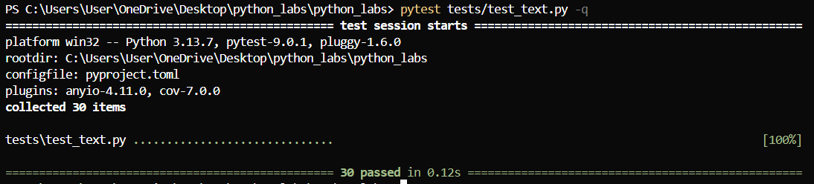

## test_json_csv
```python
import pytest
from pathlib import Path
import json
import csv
from src.lab05.json_to_csv import json_to_csv
from src.lab05.csv_to_json import csv_to_json


def test_json_to_csv_roundtrip(tmp_path: Path):
    src = tmp_path / "people.json"
    dst = tmp_path / "people.csv"
    data = [
        {"name": "Alice", "age": 22},
        {"name": "Bob", "age": 25},
    ]
    src.write_text(json.dumps(data, ensure_ascii=False, indent=2), encoding="utf-8")
    json_to_csv(str(src), str(dst))

    with dst.open(encoding="utf-8") as f:
        rows = list(csv.DictReader(f))

    assert len(rows) == 2
    assert {"name", "age"} <= set(rows[0].keys())


def test_csv_to_json_roundtrip(tmp_path: Path):
    src = tmp_path / "people.csv"
    dst = tmp_path / "people.json"

    csv_content = "name,age\nAlice,22\nBob,25"
    src.write_text(csv_content, encoding="utf-8")

    csv_to_json(str(src), str(dst))

    with dst.open(encoding="utf-8") as f:
        rows = list(json.load(f))

    assert len(rows) == 2
    assert {"name", "age"} <= set(rows[0].keys())


def test_json_to_csv_file_not_found():
    with pytest.raises(FileNotFoundError):
        json_to_csv("nonexistent.json", "output.csv")


def test_csv_to_json_file_not_found():
    with pytest.raises(FileNotFoundError):
        csv_to_json("nonexistent.csv", "output.json")


def test_json_to_csv_empty_file(tmp_path: Path):
    empty_json = tmp_path / "empty.json"
    empty_json.write_text("", encoding="utf-8")
    output_csv = tmp_path / "output.csv"

    with pytest.raises((ValueError, json.JSONDecodeError)):
        json_to_csv(str(empty_json), str(output_csv))


def test_json_to_csv_invalid_json(tmp_path: Path):
    invalid_json = tmp_path / "invalid.json"
    invalid_json.write_text("{invalid json}", encoding="utf-8")
    output_csv = tmp_path / "output.csv"

    with pytest.raises((ValueError, json.JSONDecodeError)):
        json_to_csv(str(invalid_json), str(output_csv))


def test_csv_to_json_empty_file(tmp_path: Path):
    empty_csv = tmp_path / "empty.csv"
    empty_csv.write_text("", encoding="utf-8")
    output_json = tmp_path / "output.json"

    csv_to_json(str(empty_csv), str(output_json))
    
    assert output_json.exists()
    with output_json.open(encoding="utf-8") as f:
        data = json.load(f)
    assert data == []


def test_csv_to_json_invalid_csv(tmp_path: Path):
    invalid_csv = tmp_path / "invalid.csv"
    invalid_csv.write_text("name,age\nAlice,22,extra\nBob", encoding="utf-8")
    output_json = tmp_path / "output.json"

    csv_to_json(str(invalid_csv), str(output_json))
    
    assert output_json.exists()
    with output_json.open(encoding="utf-8") as f:
        data = json.load(f)


def test_csv_to_json_malformed_csv(tmp_path: Path):
    malformed_csv = tmp_path / "malformed.csv"
    malformed_csv.write_text("name,age\nAlice\nBob,30", encoding="utf-8")
    output_json = tmp_path / "output.json"

    csv_to_json(str(malformed_csv), str(output_json))
    
    assert output_json.exists()
    with output_json.open(encoding="utf-8") as f:
        data = json.load(f)
```
### pytest:
[2](./images/lab07/2.png)

# Лабораторная работа № 8

## Models

```python
from dataclasses import dataclass
from datetime import date, datetime 

DATE_FORMAT = "%Y-%m-%d"
GPA_MIN = 0
GPA_MAX = 5

@dataclass
class Student:
    fio: str
    birthdate: str
    group: str
    gpa: float

    @staticmethod
    def _validate_birthdate(birthdate: str) -> date:
        try:
            return datetime.strptime(birthdate, DATE_FORMAT).date()
        except ValueError:
            raise ValueError("Некорректный формат даты")

    @staticmethod
    def _validate_gpa(value: float) -> float:
        try:
            gpa_value = float(value)
        except (TypeError, ValueError):
            raise ValueError("Средний балл должен быть числом")

        if not GPA_MIN <= gpa_value <= GPA_MAX:
            raise ValueError("Средний балл должен быть в диапазоне от 0 до 5")
        return gpa_value
    
    def __post_init__(self) -> None:
        self._birthdate_dt = Student._validate_birthdate(self.birthdate)
        self.gpa = Student._validate_gpa(self.gpa)

    def age(self) -> int:
        today = date.today()
        years = today.year - self._birthdate_dt.year
        if (today.month, today.day) < (self._birthdate_dt.month, self._birthdate_dt.day):
            years -= 1
        return years

    def to_dict(self):
        return {
            "fio": self.fio,
            "birthdate": self.birthdate,
            "group": self.group,
            "gpa": self.gpa,
        }

    @classmethod
    def from_dict(cls, data):
        return cls(
            fio=data["fio"],
            birthdate=data["birthdate"],
            group=data["group"],
            gpa=data["gpa"],
        )

    def __str__(self) -> str:
        return f"{self.fio} ({self.group}), {self.age()} лет, GPA {self.gpa:.2f}"
```

## Serialize

```python
import json
from pathlib import Path
from typing import List

from src.lab08.models import Student


def students_to_json(students: List[Student], path: str | Path) -> None:
    output_path = Path(path)
    output_path.parent.mkdir(parents=True, exist_ok=True)
    
    data = [student.to_dict() for student in students]
    with output_path.open("w", encoding="utf-8") as f:
        json.dump(data, f, ensure_ascii=False, indent=2)


def students_from_json(path: str | Path) -> List[Student]:
    input_path = Path(path)
    with input_path.open("r", encoding="utf-8") as f:
        data = json.load(f)
    
    return [Student.from_dict(item) for item in data]

if __name__ == "__main__":
    students_input = students_from_json("data/lab08/students_input.json")
    
    for student in students_input:
        print(student)
    
    students_to_json(students_input, "data/lab08/students_output.json")
```

## Файлы students_input и students_output:
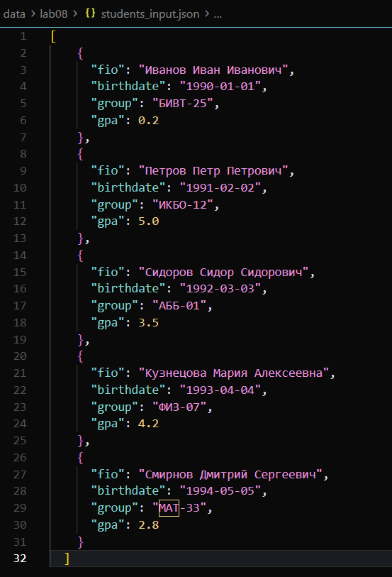

## Вывод:
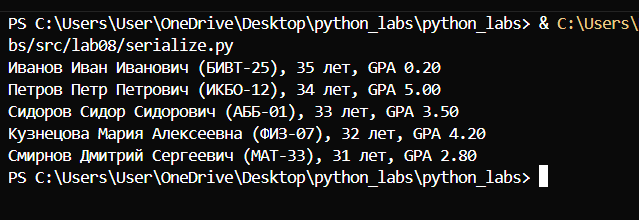

# Лабораторная работа № 9

## group
```python
import csv
from pathlib import Path
from typing import List
from src.lab08.models import Student

class Group:
    def __init__(self, storage_path: str):
        self.path = Path(storage_path)
        if not self.path.exists():
            self.path.parent.mkdir(parents=True, exist_ok=True)
            with open(self.path, 'w', newline='', encoding='utf-8') as f:
                f.write("fio,birthdate,group,gpa\n")
    
    def _read_all(self):
        if not self.path.exists():
            return []
        with open(self.path, 'r', newline='', encoding='utf-8') as f:
            reader = csv.DictReader(f)
            return list(reader)
    
    def _write_all(self, rows):
        with open(self.path, 'w', newline='', encoding='utf-8') as f:
            writer = csv.DictWriter(f, fieldnames=["fio", "birthdate", "group", "gpa"])
            writer.writeheader()
            writer.writerows(rows)
    
    def list(self):
        rows = self._read_all()
        students = []
        for row in rows:
            try:
                student = Student.from_dict(row)
                students.append(student)
            except:
                continue
        return students
    
    def add(self, student: Student):
        rows = self._read_all()
        
        student_dict = student.to_dict()
        for row in rows:
            if (row['fio'] == student_dict['fio'] and
                row['birthdate'] == student_dict['birthdate'] and
                row['group'] == student_dict['group'] and
                float(row['gpa']) == float(student_dict['gpa'])):
                raise ValueError(f"Такой студент уже существует: {student.fio}")
        
        rows.append(student_dict)
        self._write_all(rows)
    
    def find(self, substr: str):
        rows = self._read_all()
        found = [row for row in rows if substr.lower() in row['fio'].lower()]
        students = []
        for row in found:
            try:
                student = Student.from_dict(row)
                students.append(student)
            except:
                continue
        return students
    
    def remove(self, fio: str):
        rows = self._read_all()
        new_rows = [row for row in rows if row['fio'] != fio]
        if len(new_rows) < len(rows):
            self._write_all(new_rows)
            return True
        return False
    
    def update(self, fio: str, **fields):
        rows = self._read_all()
        updated = False
        
        for i, row in enumerate(rows):
            if row['fio'] == fio:
                updated = True
                
                temp_row = row.copy()
                for key, value in fields.items():
                    if key in ["fio", "birthdate", "group", "gpa"]:
                        if key == 'gpa':
                            value = str(float(value))
                        temp_row[key] = str(value)
                
                for j, other_row in enumerate(rows):
                    if i != j:
                        if (temp_row['fio'] == other_row['fio'] and
                            temp_row['birthdate'] == other_row['birthdate'] and
                            temp_row['group'] == other_row['group'] and
                            float(temp_row['gpa']) == float(other_row['gpa'])):
                            raise ValueError(f"После обновления будет дубликат студента: {temp_row['fio']}")
                
                for key, value in fields.items():
                    if key in ["fio", "birthdate", "group", "gpa"]:
                        if key == 'gpa':
                            value = str(float(value))
                        rows[i][key] = str(value)
        
        if not updated:
            raise ValueError(f"Студент {fio} не найден")
        
        self._write_all(rows)
```

## Проверяем все методы через терминал:
```python
python -c "
from src.lab08.models import Student
from src.lab09 import Group

print('ЛР9: ТЕСТ')
print('='*30)

g = Group('data/lab09/students.csv')

# Тест 1: LIST
print('****LIST:')
[print(f'{s.fio}, {s.birthdate}, {s.group}, {s.gpa}') for s in g.list()]

# Тест 2: ADD
print('****ADD:')
g.add(Student('Иван','2000-01-01','БИВТ-34',5))
print('Добавлен')
[print(f'{s.fio}, {s.birthdate}, {s.group}, {s.gpa}') for s in g.list()]

# Тест 3: FIND
print('****FIND:')
print(f'FIND: {g.find('петрова')}')

# Тест 4: UPDATE
print('****UPDATE:')
g.update('Сидоров Алексей',gpa=4.8); print('UPDATE: GPA обновлен')
[print(f'{s.fio}, {s.birthdate}, {s.group}, {s.gpa}') for s in g.list()]

# Тест 5: REMOVE
print('****REMOVE:')
g.remove('Иван'); print('REMOVE: студент удален')
[print(f'{s.fio}, {s.birthdate}, {s.group}, {s.gpa}') for s in g.list()]

print('='*30)
print('ВСЕ МЕТОДЫ РАБОТАЮТ КОРРЕКТНО')
"
```
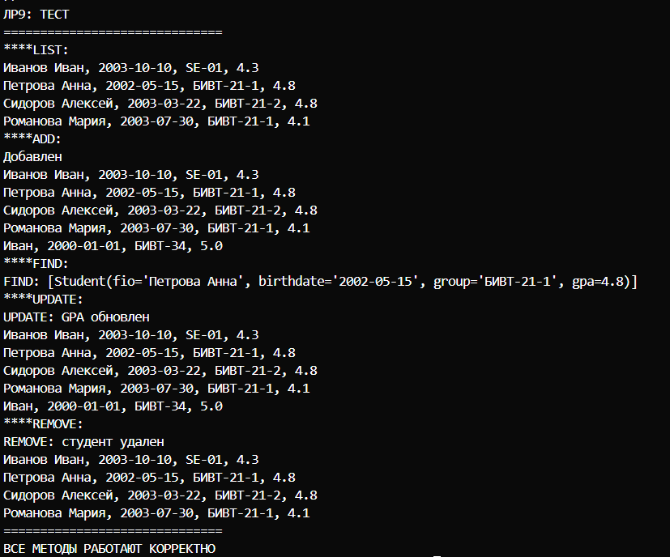

## Запускаем метод LIST:
```python
python -c "from src.lab09 import Group; g=Group('data/lab09/students.csv'); print('LIST:'); [print(f'{s.fio}, {s.birthdate}, {s.group}, {s.gpa}') for s in g.list()]"
```
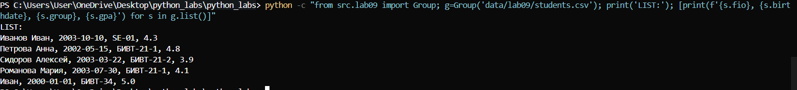

## Запускаем метод ADD:
```python
python -c "from src.lab08.models import Student; from src.lab09 import Group; g=Group('data/lab09/students.csv'); g.add(Student('Иван','2000-01-01','БИВТ-34',5)); print('Добавлен'); [print(f'{s.fio}, {s.birthdate}, {s.group}, {s.gpa}') for s in g.list()]"
```
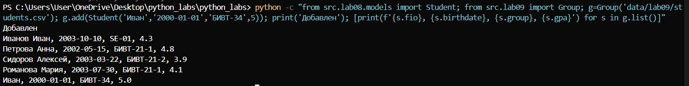

## Запускаем метод FIND:
```python
python -c "from src.lab09 import Group; g=Group('data/lab09/students.csv'); print(f'FIND: {g.find('петрова')}')" 
```
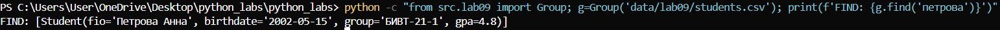

## Запускаем метод UPDATE:
```python
python -c "from src.lab09 import Group; g=Group('data/lab09/students.csv'); g.update('Сидоров Алексей',gpa=4.8); print('UPDATE: GPA обновлен'); [print(f'{s.fio}, {s.birthdate}, {s.group}, {s.gpa}') for s in g.list()]"
```
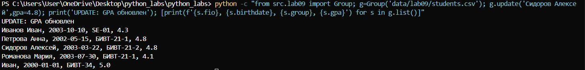

## Запускаем метод REMOVE:
```python
python -c "from src.lab09 import Group; g=Group('data/lab09/students.csv'); g.remove('Иван'); print('REMOVE: студент удален'); [print(f'{s.fio}, {s.birthdate}, {s.group}, {s.gpa}') for s in g.list()]"
```
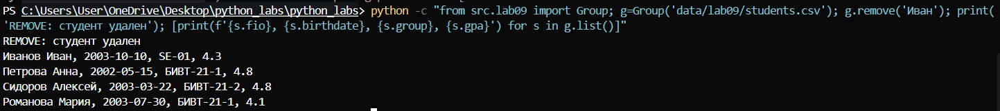


# Лабораторная работа № 10

## Теория

### Стек (Stack)
*Стек — структура данных, работающая по принципу LIFO (Last In, First Out — "последним пришел, первым ушел").

*Основные операции и их сложность:
- `push(item)` — добавление элемента на вершину стека: O(1)
- `pop()` — удаление и возврат элемента с вершины: O(1)
- `peek()` — просмотр элемента на вершине без удаления: O(1)
- `is_empty()` — проверка на пустоту: O(1)

### Очередь (Queue)
*Очередь — структура данных, работающая по принципу FIFO (First In, First Out — "первым пришел, первым ушел").

Основные операции и их сложность:
- `enqueue(item)` — добавление элемента в конец очереди: O(1)
- `dequeue()` — удаление и возврат элемента из начала: O(1)
- `peek()` — просмотр первого элемента без удаления: O(1)
- `is_empty()` — проверка на пустоту: O(1)

### Односвязный список (Singly Linked List)
*Связный список — динамическая структура данных, состоящая из узлов, каждый из которых содержит значение и ссылку на следующий узел.

Основные операции и их сложность:
- `append(value)` — добавление в конец: O(1) с tail, O(n) без tail
- `prepend(value)` — добавление в начало: O(1)
- `insert(idx, value)` — вставка по индексу: O(n) в худшем случае
- `remove(value)` — удаление по значению: O(n)
- `remove_at(idx)` — удаление по индексу: O(n)
- Поиск элемента: O(n)
- Доступ по индексу: O(n)

## Structures
```python
from collections import deque
from typing import Any, Optional


class Stack:
    """
    Стек (LIFO) на базе списка Python.
    Вершина стека - последний элемент списка.
    """
    
    def __init__(self):
        """Инициализирует пустой стек."""
        self._data = []
    
    def push(self, item: Any) -> None:
        """
        Добавляет элемент на вершину стека.
        """
        self._data.append(item)
    
    def pop(self) -> Any:
        """
        Удаляет и возвращает элемент с вершины стека.
        
        Returns:
            Элемент с вершины стека.
        
        Raises:
            IndexError: Если стек пуст.
        """
        if self.is_empty():
            raise IndexError("pop from empty stack")
        return self._data.pop()
    
    def peek(self) -> Optional[Any]:
        """
        Возвращает элемент с вершины стека без удаления.
        
        Returns:
            Элемент с вершины стека или None, если стек пуст.
        """
        if self.is_empty():
            return None
        return self._data[-1]
    
    def is_empty(self) -> bool:
        """
        Проверяет, пуст ли стек.
        
        Returns:
            True, если стек пуст, иначе False.
        """
        return len(self._data) == 0
    
    def __len__(self) -> int:
        """
        Возвращает количество элементов в стеке.
        
        Returns:
            Количество элементов.
        """
        return len(self._data)
    
    def __repr__(self) -> str:
        return f"Stack({self._data})"


class Queue:
    """
    Очередь (FIFO) 
    """
    
    def __init__(self):
        """Инициализирует пустую очередь."""
        self._data = deque()
    
    def enqueue(self, item: Any) -> None:
        """
        Добавляет элемент в конец очереди.
        """
        self._data.append(item)
    
    def dequeue(self) -> Any:
        """
        Удаляет и возвращает элемент из начала очереди.
        
        Returns:
            Элемент из начала очереди.
        
        Raises:
            IndexError: Если очередь пуста.
        """
        if self.is_empty():
            raise IndexError("dequeue from empty queue")
        return self._data.popleft()
    
    def peek(self) -> Optional[Any]:
        """
        Возвращает элемент из начала очереди без удаления.
        
        Returns:
            Элемент из начала очереди или None, если очередь пуста.
        """
        if self.is_empty():
            return None
        return self._data[0]
    
    def is_empty(self) -> bool:
        """
        Проверяет, пуста ли очередь.
        
        Returns:
            True, если очередь пуста, иначе False.
        """
        return len(self._data) == 0
    
    def __len__(self) -> int:
        """
        Возвращает количество элементов в очереди.
        
        Returns:
            Количество элементов.
        """
        return len(self._data)
    
    def __repr__(self) -> str:
        return f"Queue({list(self._data)})"
```

## Linked_list

```python
from typing import Any, Iterator, Optional


class Node:
    """
    Узел односвязного списка.
    
    Attributes:
        value: Значение элемента.
        next: Ссылка на следующий узел.
    """
    
    def __init__(self, value: Any, next: Optional['Node'] = None):
        """
        Инициализирует узел.
        
        Args:
            value: Значение узла.
            next: Ссылка на следующий узел.
        """
        self.value = value
        self.next = next
    
    def __repr__(self) -> str:
        return f"Node({self.value})"


class SinglyLinkedList:
    """
    Односвязный список.
    
    Attributes:
        head: Первый узел списка.
        tail: Последний узел списка.
        _size: Количество элементов.
    """
    
    def __init__(self):
        """Инициализирует пустой список."""
        self.head = None
        self.tail = None
        self._size = 0
    
    def append(self, value: Any) -> None:
        """
        Добавляет элемент в конец списка.
        
        Args:
            value: Значение для добавления.
        """
        new_node = Node(value)
        
        if self.head is None:
            self.head = new_node
            self.tail = new_node
        else:
            self.tail.next = new_node
            self.tail = new_node
        
        self._size += 1
    
    def prepend(self, value: Any) -> None:
        """
        Добавляет элемент в начало списка.
        
        Args:
            value: Значение для добавления.
        """
        new_node = Node(value, self.head)
        self.head = new_node
        
        if self.tail is None:
            self.tail = new_node
        
        self._size += 1
    
    def insert(self, idx: int, value: Any) -> None:
        """
        Вставляет элемент по указанному индексу.
        
        Args:
            idx: Индекс для вставки (от 0 до len(list)).
            value: Значение для вставки.
        
        Raises:
            IndexError: Если индекс вне диапазона.
        """
        if idx < 0 or idx > self._size:
            raise IndexError(f"index {idx} out of range [0, {self._size}]")
        
        # Вставка в начало
        if idx == 0:
            self.prepend(value)
            return
        
        # Вставка в конец
        if idx == self._size:
            self.append(value)
            return
        
        # Вставка в середину
        current = self.head
        for _ in range(idx - 1):
            current = current.next
        
        new_node = Node(value, current.next)
        current.next = new_node
        self._size += 1
    
    def remove(self, value: Any) -> None:
        """
        Удаляет первое вхождение указанного значения.
        """
        # Пустой список
        if self.head is None:
            return
        
        # Удаление из начала
        if self.head.value == value:
            self.head = self.head.next
            self._size -= 1
            
            if self.head is None:  # Список стал пустым
                self.tail = None
            return
        
        # Поиск узла для удаления
        current = self.head
        while current.next is not None and current.next.value != value:
            current = current.next
        
        # Значение не найдено
        if current.next is None:
            return
        
        # Удаление узла
        current.next = current.next.next
        self._size -= 1
        
        # Если удалили последний элемент
        if current.next is None:
            self.tail = current
    
    def remove_at(self, idx: int) -> Any:
        """
        Удаляет элемент по указанному индексу.
        
        Returns:
            Значение удаленного элемента.
        
        Raises:
            IndexError: Если индекс вне диапазона.
        """
        if idx < 0 or idx >= self._size:
            raise IndexError(f"index {idx} out of range [0, {self._size - 1}]")
        
        # Удаление из начала
        if idx == 0:
            value = self.head.value
            self.head = self.head.next
            self._size -= 1
            
            if self.head is None:  # Список стал пустым
                self.tail = None
            
            return value
        
        # Поиск узла перед удаляемым
        current = self.head
        for _ in range(idx - 1):
            current = current.next
        
        # Удаление узла
        value = current.next.value
        current.next = current.next.next
        self._size -= 1
        
        # Если удалили последний элемент
        if current.next is None:
            self.tail = current
        
        return value
    
    def __iter__(self) -> Iterator[Any]:
        """
        Возвращает итератор по значениям списка.
        
        Yields:
            Значения элементов в порядке от начала к концу.
        """
        current = self.head
        while current is not None:
            yield current.value
            current = current.next
    
    def __len__(self) -> int:
        """
        Возвращает количество элементов в списке.
        
        Returns:
            Количество элементов.
        """
        return self._size
    
    def __repr__(self) -> str:
        values = list(self)
        return f"SinglyLinkedList({values})"
```

## Тестируем:

### Stack
```python
from src.lab10.structures import Stack
s = Stack()
s.push(1)
s.push(2)    
print(s.peek())
print(s.pop())  
print(s.pop())  
print(s.is_empty()) 
```

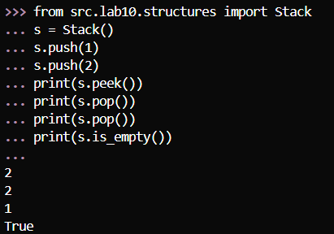

### Queue
```python 
from src.lab10.structures import Queue
q = Queue()
q.enqueue('A')
q.enqueue('B')    
q.enqueue('C')    
print(q.peek())    
print(q.dequeue()) 
print(q.dequeue()) 
print(len(q))
```
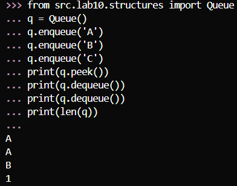


### SinglyLinkedList
```python
from src.lab10.linked_list import SinglyLinkedList
lst = SinglyLinkedList()
lst.append(10)     
lst.prepend(5)    
lst.append(20)      
lst.insert(2, 15)   

for value in lst:
    print(value)    


lst.remove(10)     
print(lst.remove_at(1))  

print(len(lst))    
print(lst)         
```

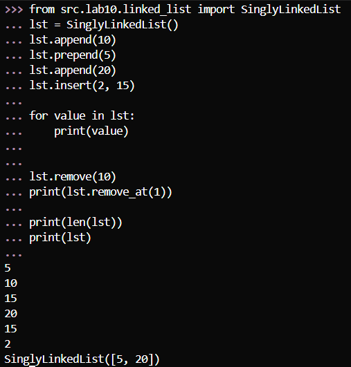