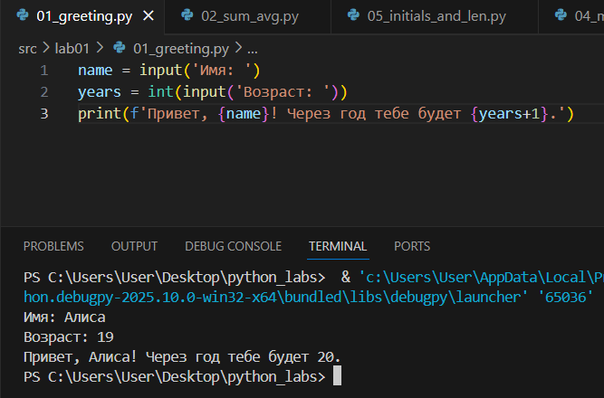

# Лабораторная работа № 1

## Задание 1


## Задание 2


## Задание 3 


## Задание 4


## Задание 5 


# Лабораторная работа № 2

## Задание 1

```python
def min_max(nums: list[float | int]) -> tuple[float | int, float | int]:
    if not nums:
        return 'ValueError'
    return (min(nums), max(nums))
t = [3, -1, 5, 5, 0]
print(min_max(t))
```


```python
def unique_sorted(nums: list[float | int]) -> list[float | int]:
    if not nums:
        return 'ValueError'
    return sorted(set(nums))
t = [3, 1, 2, 1, 3]
print(unique_sorted(t))
```


```python
def flatten(mat: list[list | tuple]) -> list:
   if not mat:
      return [] 
   
   row = len(mat[0])
   for row1 in mat:
    if len(row1) != row:
         return 'ValueError'
    res = []
    for row1 in mat:
        res.extend(row1)
    return res
t = [[1, 2], [3, 4]]
print(flatten(t))
```


## Задание 2

```python
def transpose(mat: list[list[float | int]]) -> list[list]:
    if not mat:
      return []
    
    row = len(mat[0])
    for row1 in mat:
        if len(row1) != row:
         return 'ValueError'
    return [[mat[q][w] for q in range(len(mat))] for w in range(row)]
t = [[1],[2],[3]]
res = transpose(t)
print(res)
```


```python
def row_sums(mat: list[list[float | int]]) -> list[float]:
    if not mat:
      return []
    
    row = len(mat[0])
    for row1 in mat:
        if len(row1) != row:
         return 'ValueError'
    return [sum(r) for r in mat]
t = [[1, 2, 3], [4, 5, 6]]
res = row_sums(t)
print(res)
```


```python
def col_sums(mat: list[list[float | int]]) -> list[float]:
    if not mat:
      return []
    
    row = len(mat[0])
    for row1 in mat:
        if len(row1) != row:
         return 'ValueError'
    return [sum(r) for r in zip(*mat)]
t = [[1, 2, 3], [4, 5, 6]]
res = col_sums(t)
print(res)
```


## Задание 3

```python
def format_record(rec: tuple[str, str, float]) -> str:
    fio, gr, gpa = rec
    fio2 = ' '.join(fio.split()).split()
    fam = fio2[0]

    ini = []
    for i in range(1, len(fio2)):
        if i <= 2:
            ini.append(f"{fio2[i][0]}.")
    res = f"{fam} {''.join(ini)}, гр. {gr}, GPA {gpa:.2f}"
    return res
t = ('Иванов Иван Иванович', "IKBO-12", 5.0)
print(format_record(t))
```


