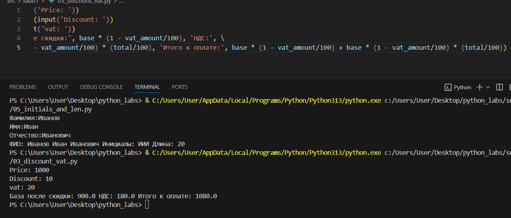
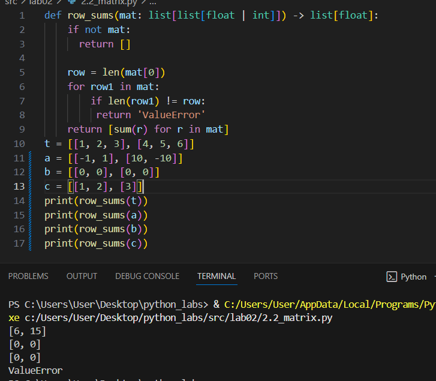

# Лабораторная работа № 1

## Задание 1


## Задание 2


## Задание 3 


## Задание 4


## Задание 5 


# Лабораторная работа № 2

## Задание 1
```python
def min_max(nums: list[float | int]) -> tuple[float | int, float | int]:
    if not nums:
        return 'ValueError'
    return (min(nums), max(nums))
t = [3, -1, 5, 5, 0]
print(min_max(t))
```


## Задание 2




## Задание 3

