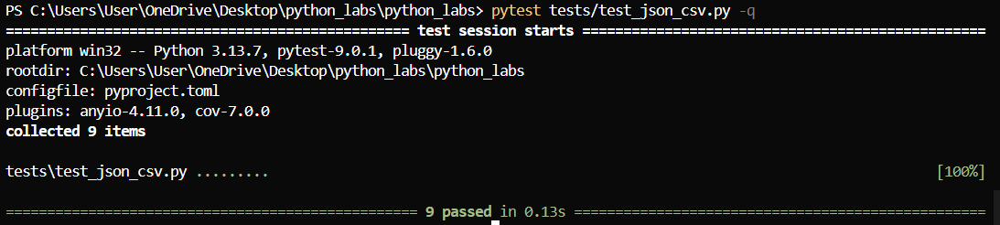

# Лабораторная работа № 7
## test_text
```python
import pytest
from src.lab04.text_processing import normalize, tokenize, count_freq, top_n


@pytest.mark.parametrize(
    "source, expected",
    [
        ("ПрИвЕт\nМИр\t", "привет мир"),
        ("ёжик, Ёлка", "ежик, елка"),
        ("Hello\r\nWorld", "hello world"),
        ("  двойные   пробелы  ", "двойные пробелы"),
    ],
)
def test_normalize_basic(source, expected):
    assert normalize(source) == expected


@pytest.mark.parametrize(
    "source, expected",
    [
        ("Привет, друзья!", ["Привет", "друзья"]),
        ("Python programming", ["Python", "programming"]),
        (" ", []),
        ("###$$$%%%", []),
        ("e-mail пользователя", ["e-mail", "пользователя"]),
        ("42 3.14 100", ["42", "3", "14", "100"]),
        ("apple banana apple", ["apple", "banana", "apple"]),
        ("один два три", ["один", "два", "три"]),
        ("C++ Java Python", ["C", "Java", "Python"]),
        ("   multiple   spaces   ", ["multiple", "spaces"]),
    ],
)
def test_tokenize_basic(source, expected):
    assert tokenize(source) == expected


@pytest.mark.parametrize(
    "tokens, expected",
    [
        (["привет", "мир", "привет"], {"привет": 2, "мир": 1}),
        (["Python", "programming"], {"Python": 1, "programming": 1}),
        ([], {}),
        (["###$$$%%%"], {"###$$$%%%": 1}),
        (["e-mail", "пользователя"], {"e-mail": 1, "пользователя": 1}),
        (["42", "3", "14", "100"], {"42": 1, "3": 1, "14": 1, "100": 1}),
        (["apple", "banana", "apple"], {"apple": 2, "banana": 1}),
        (["один", "два", "три"], {"один": 1, "два": 1, "три": 1}),
        (["C", "Java", "Python"], {"C": 1, "Java": 1, "Python": 1}),
    ],
)
def test_count_freq_basic(tokens, expected):
    assert count_freq(tokens) == expected


@pytest.mark.parametrize(
    "freq, n, expected",
    [
        ({"привет": 2, "мир": 1}, 2, [("привет", 2), ("мир", 1)]),
        ({"Python": 1, "programming": 1}, 1, [("Python", 1)]),
        ({}, 5, []),
        ({"###$$$%%%": 1}, 5, [("###$$$%%%", 1)]),
        ({"e-mail": 1, "пользователя": 1}, 2, [("e-mail", 1), ("пользователя", 1)]),
        ({"42": 1, "3.14": 1, "100": 1}, 3, [("100", 1), ("3.14", 1), ("42", 1)]),
    ],
)
def test_top_n_basic(freq, n, expected):
    assert top_n(freq, n) == expected


def test_top_n_tie_breaker():
    """Тест для случая с одинаковой частотой - должна быть сортировка по алфавиту"""
    freq = {"яблоко": 2, "банан": 2, "апельсин": 2, "вишня": 1}
    result = top_n(freq, 3)
    expected = [("апельсин", 2), ("банан", 2), ("яблоко", 2)]
    assert result == expected

```
### pytest


## test_json_csv
```python
import pytest
from pathlib import Path
import json
import csv
from src.lab05.json_to_csv import json_to_csv
from src.lab05.csv_to_json import csv_to_json


def test_json_to_csv_roundtrip(tmp_path: Path):
    src = tmp_path / "people.json"
    dst = tmp_path / "people.csv"
    data = [
        {"name": "Alice", "age": 22},
        {"name": "Bob", "age": 25},
    ]
    src.write_text(json.dumps(data, ensure_ascii=False, indent=2), encoding="utf-8")
    json_to_csv(str(src), str(dst))

    with dst.open(encoding="utf-8") as f:
        rows = list(csv.DictReader(f))

    assert len(rows) == 2
    assert {"name", "age"} <= set(rows[0].keys())


def test_csv_to_json_roundtrip(tmp_path: Path):
    src = tmp_path / "people.csv"
    dst = tmp_path / "people.json"

    csv_content = "name,age\nAlice,22\nBob,25"
    src.write_text(csv_content, encoding="utf-8")

    csv_to_json(str(src), str(dst))

    with dst.open(encoding="utf-8") as f:
        rows = list(json.load(f))

    assert len(rows) == 2
    assert {"name", "age"} <= set(rows[0].keys())


def test_json_to_csv_file_not_found():
    with pytest.raises(FileNotFoundError):
        json_to_csv("nonexistent.json", "output.csv")


def test_csv_to_json_file_not_found():
    with pytest.raises(FileNotFoundError):
        csv_to_json("nonexistent.csv", "output.json")


def test_json_to_csv_empty_file(tmp_path: Path):
    empty_json = tmp_path / "empty.json"
    empty_json.write_text("", encoding="utf-8")
    output_csv = tmp_path / "output.csv"

    with pytest.raises((ValueError, json.JSONDecodeError)):
        json_to_csv(str(empty_json), str(output_csv))


def test_json_to_csv_invalid_json(tmp_path: Path):
    invalid_json = tmp_path / "invalid.json"
    invalid_json.write_text("{invalid json}", encoding="utf-8")
    output_csv = tmp_path / "output.csv"

    with pytest.raises((ValueError, json.JSONDecodeError)):
        json_to_csv(str(invalid_json), str(output_csv))


def test_csv_to_json_empty_file(tmp_path: Path):
    empty_csv = tmp_path / "empty.csv"
    empty_csv.write_text("", encoding="utf-8")
    output_json = tmp_path / "output.json"

    csv_to_json(str(empty_csv), str(output_json))
    
    assert output_json.exists()
    with output_json.open(encoding="utf-8") as f:
        data = json.load(f)
    assert data == []


def test_csv_to_json_invalid_csv(tmp_path: Path):
    invalid_csv = tmp_path / "invalid.csv"
    invalid_csv.write_text("name,age\nAlice,22,extra\nBob", encoding="utf-8")
    output_json = tmp_path / "output.json"

    csv_to_json(str(invalid_csv), str(output_json))
    
    assert output_json.exists()
    with output_json.open(encoding="utf-8") as f:
        data = json.load(f)


def test_csv_to_json_malformed_csv(tmp_path: Path):
    malformed_csv = tmp_path / "malformed.csv"
    malformed_csv.write_text("name,age\nAlice\nBob,30", encoding="utf-8")
    output_json = tmp_path / "output.json"

    csv_to_json(str(malformed_csv), str(output_json))
    
    assert output_json.exists()
    with output_json.open(encoding="utf-8") as f:
        data = json.load(f)
```

